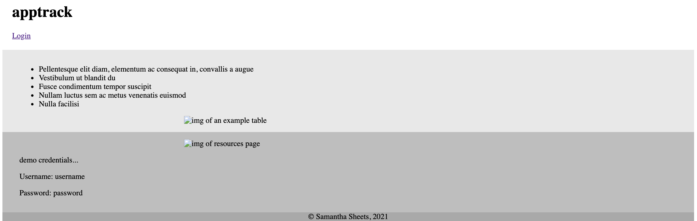
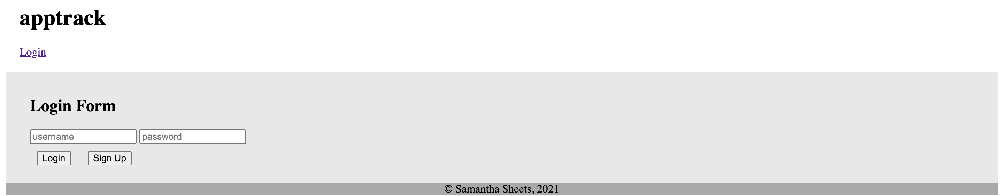
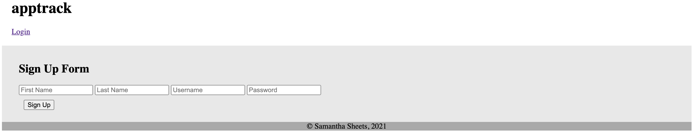
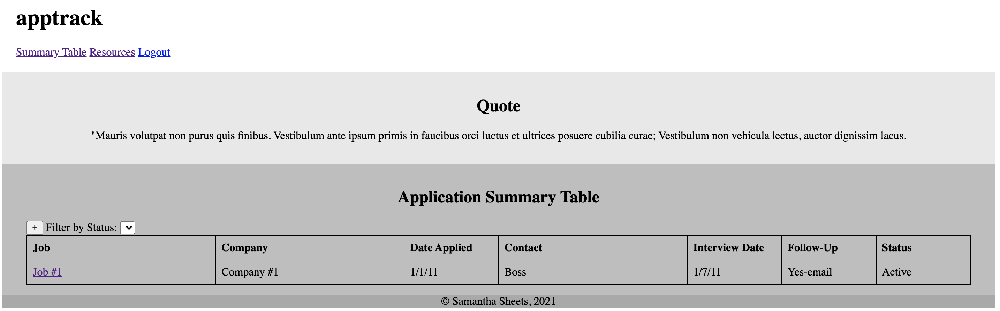
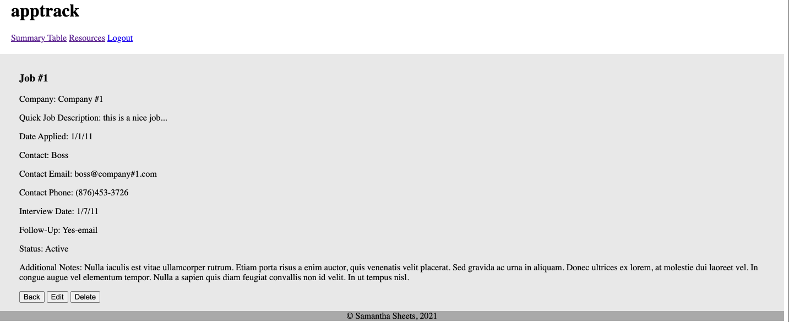
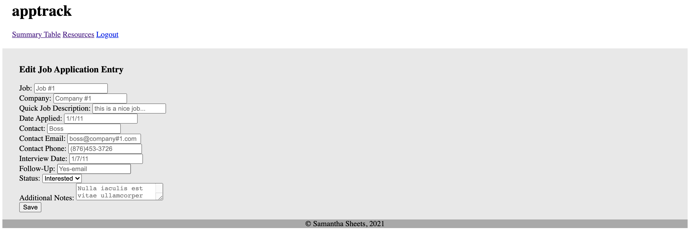
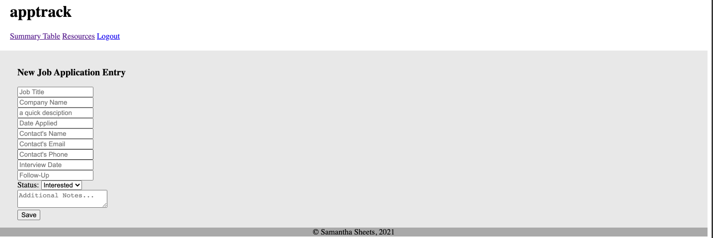
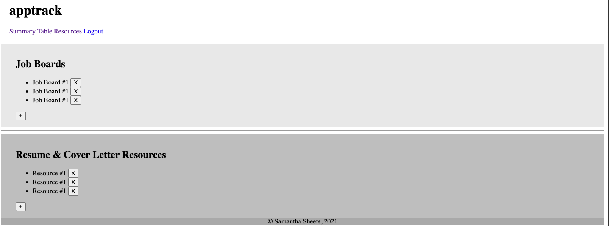
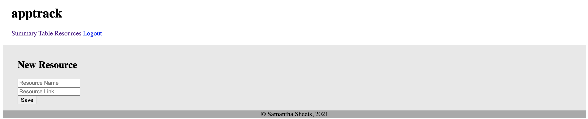

# apptrack Wireframes
These basic, grayscale wireframes were built in preparation for 'apptrack'.

## Live Demo
Click [here](https://7424243.github.io/apptrack-wireframes/) to see a live demo.

## Screens

### Landing Page

### Login Page

### Sign Up Page

### Home Page

### Application Details Page

### Edit Application Page

### Add New Job Application Page

### Resources Page

### Add New Resource Page

## Summary
These basic wireframes were built to aid in the building of apptrack-client & apptrack-server.

## Built With
* HTML
* CSS
